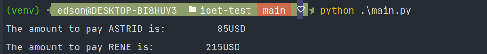
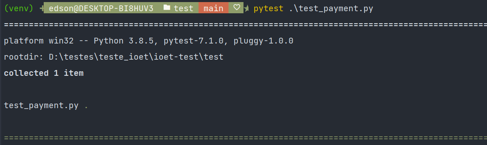

# ioet-test
___

Statement: The company ACME offers their employees the flexibility to work the hours they want. 
They will pay for the hours worked based on the day of the week and time of day, according to the following table:

Monday - Friday

00:01 - 09:00 25 USD

09:01 - 18:00 15 USD

18:01 - 00:00 20 USD

Saturday and Sunday

00:01 - 09:00 30 USD

09:01 - 18:00 20 USD

18:01 - 00:00 25 USD

The goal of this exercise is to calculate the total that the company has to pay an employee, based on the hours they worked and the times during which they worked. The following abbreviations will be used for entering data:

MO: Monday

TU: Tuesday

WE: Wednesday

TH: Thursday

FR: Friday

SA: Saturday

SU: Sunday

Input: the name of an employee and the schedule they worked, indicating the time and hours.
This should be a .txt file with at least five sets of data.
___

This is an exercise to check how much money should be paid for an employee.

The programing language used is Python and all instructions to run the code are shown below:

1 - Create a virtual environment to install the library pytest

pip install virtualenv
 
python -m venv venv or python3 -m venv venv
 

In case of any doubts, the steps to create virtualenv are described in the link below:
 
https://packaging.python.org/en/latest/guides/installing-using-pip-and-virtual-environments/

### To activate the environment 
 
LINUX -> source env/bin/activate
 
WINDOWS -> .\env\Scripts\activate
 

Then execute the command pip install pytest.

Since the virtual environment is activated the command python main.py should be executed.
 
Any other employees should be added in the folder employees to have their payments calculated.

### Performing the test using Pytest
In the folder .test/ it's necessary to execute the command pytest + the test file.
 

Three tests were implemented:
Execute the command pytest + filename in the test folder.

- test_payment.py (Use only the ASTRID example)
- test_read_folder_correct.py (Use the ASTRID and RENE examples)
- test_read_folder_empty.py (keep the folder empty)

Make sure to change the directory indicating the correct path where the test folder is located.

Example : 
- Linux: /home/edson/ioet-test/employees
- Windows: D:/testes/teste_ioet/ioet-test/employees

The only external library used is pytest, all other libraries such as OS and datetime belong to the default python package.